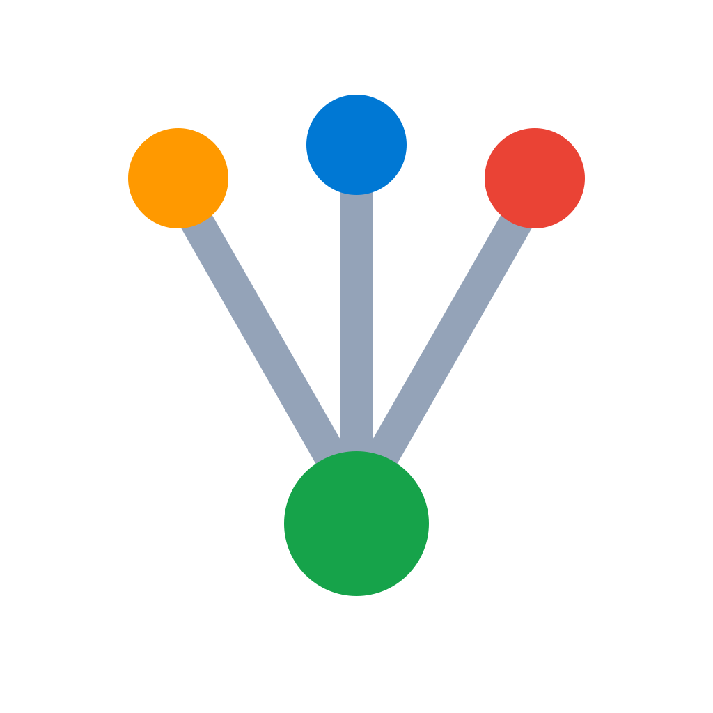

<p align="center">
  
</p>

# Stratus

**A multi-cloud gateway to your virtual machines.** Authenticate once, see all your VMs across AWS, Azure and GCP according to your permissions, and connect in a single click.


---

## Overview

Modern environments are spread across several clouds. Connecting to a virtual machine today means knowing where it lives, finding the right credentials, opening the right console and managing your keys. Stratus removes that friction: a single sign-on, an inventory aggregated and filtered by your permissions, and a one-click connection through each provider's native method.

Stratus is a desktop application (Linux, macOS, Windows) shipped as a single binary, paired with a command-line interface for automation.

## Features

- Single sign-on (SSO) to AWS, Azure and GCP through the system browser (RFC 8252).
- Aggregated VM inventory, filtered by each platform's RBAC: you only see what you are allowed to see.
- One-click connection, no SSH key to manage: SSM Session Manager (AWS), Bastion or SSH (Azure), IAP (GCP).
- Filtering and search by provider, region, state and tag.
- Local audit log of launched connections.
- Command-line mode for scripts and automation.

## Architecture

Stratus separates a UI-independent core, connectors (one per provider, each implementing a common `CloudConnector` interface), and two frontends: the Wails graphical interface and the CLI. VM discovery goes through the official cloud SDKs; connection is delegated to the providers' native CLIs. The full detail is in [`docs/requirements-specification.md`](docs/requirements-specification.md).

## Tech stack

| Layer | Choice |
|---|---|
| Backend language | Go 1.25+ |
| Desktop framework | Wails v2 (native webview, single binary) |
| Frontend | React + TypeScript (Vite) |
| Styling | Tailwind v4 |
| Cloud SDKs | aws-sdk-go-v2, azure-sdk-for-go, google-cloud-go |

## Prerequisites

Go 1.25+, Node.js 20+, Git, the Wails CLI, and the CLIs of the targeted providers (AWS CLI v2 plus `session-manager-plugin` for the MVP). The full procedure is in [`docs/getting-started.md`](docs/getting-started.md).

## Quick start

```bash
# Clone
git clone https://github.com/muhamm-ad/stratus.git
cd stratus/src

# Install dependencies
go mod tidy
cd frontend && npm install && cd ..

# Run in development mode (hot reload)
wails dev
```

To build the production binary: `wails build` (or `task build`).

## Repository structure

```
stratus/
├── docs/          # documentation (requirements, guides, design)
├── src/           # Go module + Wails project
│   ├── core/      # business logic (auth, inventory, session, audit)
│   ├── connectors/# one package per provider (aws, azure, gcp)
│   ├── cmd/       # command-line interface
│   └── frontend/  # React + TypeScript interface
└── ...            # configuration files at the root
```

## Roadmap

- **Milestone 0** — Go + Wails foundation, `CloudConnector` interface, loopback authentication server.
- **Milestone 1** — AWS MVP: IAM Identity Center SSO, EC2 inventory, SSM connection.
- **Milestone 2** — Azure connector (Entra ID, Bastion/SSH).
- **Milestone 3** — GCP connector (OAuth, IAP).
- **Milestone 4** — Hardening: signed multi-OS packaging, advanced filters, documentation.

## Contributing

Branching model: `main` (stable), `dev` (integration), and one `feature/<provider>` branch per connector. We start with `feature/aws`. Every merge flows up through a Merge Request (`feature/...` into `dev`, then `dev` into `main`).
