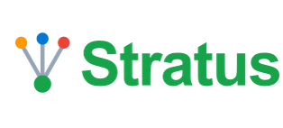

<div align="center">



**A multi-cloud gateway to your virtual machines.** Authenticate once, see all your VMs across AWS, Azure and GCP according to your permissions, and connect in a single click.


[](https://goreportcard.com/report/github.com/muhamm-ad/stratus)
[](https://github.com/muhamm-ad/stratus/releases/latest)

</div>

---

## Overview

Modern environments are spread across several clouds. Connecting to a virtual machine today means knowing where it lives, finding the right credentials, opening the right console and managing your keys. Stratus removes that friction: a single sign-on, an inventory aggregated and filtered by your permissions, and a one-click connection through each provider's native method.

Stratus is a desktop application (Linux, macOS, Windows) shipped as a single binary, paired with a command-line interface for automation.

## Features

- Single sign-on (SSO) to AWS, Azure and GCP through the system browser (RFC 8252).
- Aggregated VM inventory, filtered by each platform's RBAC: you only see what you are allowed to see.
- One-click connection, no SSH key to manage: SSM Session Manager (AWS), Bastion or SSH (Azure), IAP (GCP).
- Filtering and search by provider, region, state and tag.
- Local audit log of launched connections.
- Command-line mode for scripts and automation.

## Architecture

Stratus separates a UI-independent core, connectors (one per provider, each implementing a common `CloudProvider` interface), and two frontends: the Wails graphical interface and the CLI. VM discovery goes through the official cloud SDKs; connection is delegated to the providers' native CLIs. The full detail is in [`docs/requirements-specification.md`](docs/requirements-specification.md).

## Prerequisites

Go 1.25+, Node.js 20+, Git, the Wails CLI. The full procedure is in [`docs/getting-started.md`](docs/getting-started.md).

## Quick start

Clone the repository

```bash
git clone https://github.com/muhamm-ad/stratus.git
cd stratus
```

Install dependencies

```bash
go mod tidy
```

### Using the TUI

```bash
# From the Stratus repo root
go run cmd/tui/main.go
```

### Using the CLI

Run in development mode (hot reload)

```bash
wails dev
```

To build the production binary: `wails build` (or `task build`).

## Repository structure

```text
├── cmd/           # command-line interface
├── configs/       # configuration files
├── internal/      # Go module
├── scripts/       # scripts
├── frontend/      # React + TypeScript interface (submodule)
├── docs/          # documentation
├── website/       # website (submodule in progress)
└── README.md      # this file
```

## Contributing

We welcome contributions! Please read the [contribution guidelines](CONTRIBUTING.md) before submitting a pull request.

## Contact

If you have any questions or feedback, please open an issue.
